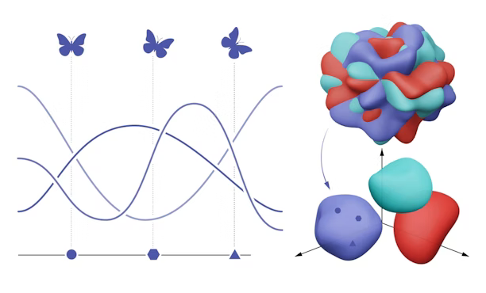

 

The NeuroAI and Geometry lab is located at the Center of Neuroscience at NYU and the Flatiron Institute. Our lab seeks to develop mathematical theories for understanding how structure gives rise to function in biological and artificial neural networks. We focuses on addressing this question through two broad approaches at the intersection of deep learning and brain science: 

<ol class="list-group">
<li id="style-font"> developing mathematical theories for characterizing the structure of representations in artificial neural networks and the brain </li>
<li id="style-font"> building ANN models of the brain with neurally plausible architecture and learning rules </li>
</ol>

To do this, we combine computational tools from theoretical physics, applied math, and machine learning. Alongside this theoretical work, we develop close collaborations with experimentalists to be inspired by and to test ideas on neural data.
 

