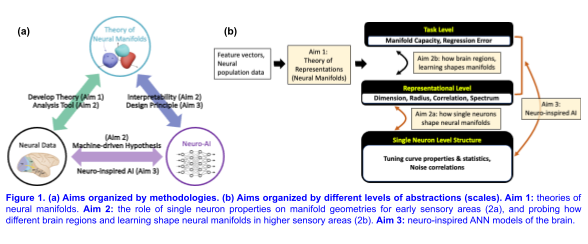
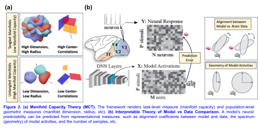
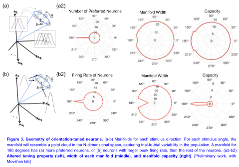
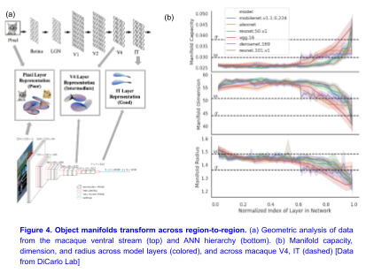
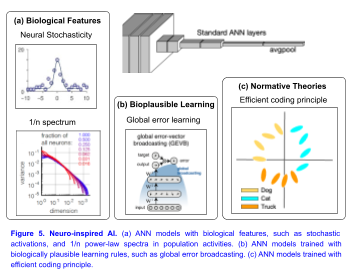

<h1> Research Statement </h1>
<h5> Dr. SueYeon Chung </h5>
<h2 style="text-align: center;"> Computing with Neural Manifolds:   Towards a Unified Understanding of Biological and Artificial Neural Networks </h2>

 A central goal in neuroscience is to understand how orchestrated computations in the brain arise from the properties of individual neurons and networks of such neurons. To achieve this, it is crucial to bridge phenomena across multiple scales, from the microscopic responses of individual neurons to the emergent macroscopic phenomena of cognitive and task functions. The structures of neuron population activities manifest themselves as neural representations. Neural computation can be viewed as a series of transformations of these representations through various processing stages of the brain. Therefore, theories that help us comprehend the structure and transformation of these representations illuminate the 'black box' of computation in both biological and artificial neural networks. 

 The primary focus of my lab's research is to develop such theories of neural representations that describe the principles of neural coding and, importantly, capture the complex structure of real data from both biological and artificial systems. To achieve this, we construct theories, methods, and models that capture normative principles connecting multiple scales and levels of abstraction. In this context, I will discuss three related approaches, describing both past and ongoing work, and future directions. 

<table class="center">
    <tr>
    <td> </td>
    </tr>
</table>

<h3> Aim 1. Theory of Neural Manifolds </h3>

 Recent progress in experimental neuroscience technologies has enabled recording from large populations of neurons. These large and high-dimensional datasets are an opportunity and a challenge for theorists, necessitating the development of novel tools and methods for interpretation. Concurrently, remarkable advancements in the field of machine learning have led to the emergence of  task-trained artificial neural networks (ANNs) outperforming traditional neuronal models in predicting neural activities. As such, these ANNs are often seen as promising models for biological neural circuits [1,2]. However, explaining their predictive power has been difficult,  as the inner workings of ANN-based models are often opaque and hard to understand. Both these challenges highlight the need for new tools to analyze high-dimensional neural activities not only for directly analyzing neural data, but also for interpreting the inner workings of highly utilized machine-generated models of the brain[3]. To address this, we develop new theoretical frameworks for evaluating the structure of high-dimensional neural data via the geometry of neural population activities in relation to the relevant computational processing embedded in the representation (Figure 1). 

<h4> 1A. Manifold Capacity Theory: Theory of Task-Efficient Representations </h4>

 To address the challenge of characterizing high-dimensional neural data for complex tasks such as invariant object recognition, we have developed a new geometric theory of neural representations rooted in statistical physics and machine learning [4–7]. This theory connects geometric structures that arise from neural population responses (i.e., neural manifolds) to the neural representation’s efficiency in implementing a task. In particular, this theory describes how many neural manifolds can be represented (or ‘packed’) in the neural activity space while they can be linearly decoded by a downstream readout neuron. The intuition from this theory is remarkably simple: like a sphere packing problem in physical space, we can encode many ‘neural manifolds’ into the neural activity space if these manifolds are small and low-dimensional, and fewer if they are large and/or high-dimensional (Figure 2a). In this framework, the notion of manifold capacity can be interpreted as how many category manifolds can be packed into the neural state space subject to linear separability. We have used this Manifold Capacity Theory to show how categorical information emerges across a range of applications, from vision[6,8,9] and audition [10–12] to language processing[13,14]. 

<table class="center">
    <tr>
    <td> </td>
    </tr>
</table>

<h4> 1B. Interpretable Theory for Comparing Network Models and Neural Data </h4>

 Even after a decade of research, it is unclear how and why the responses of neurons in the visual cortex can be so well predicted – better than any other approach – by linearly regressing them from the representations of pretrained ANNs. Moreover, distinguishing between various ANN models that predict neural responses with equal proficiency remains a significant challenge. To address these challenges, our recent work[15] extends theories on generalization error of kernel regression [16] to the case of regression between model activations and neural responses, and shows that a model’s emergent neural prediction error can be decomposed into representational measures, such as the alignment between model and neural data, and the spectral properties (geometry) of model activities (Figure 2b). We test a large number of deep neural networks that predict visual cortical activity and show that there are a wide array of scenarios that result in low neural prediction error. The work demonstrates that carefully decomposing representational metrics can provide interpretability of how models are capturing neural activity and points the way towards improved models of neural activity. 

<h3> Aim 2. Neural Manifolds as a Multi-Level Population Coding Framework </h3>
<h4> 2A. Connecting Population Geometry to Single Neuron Tuning Properties </h4>

 As described in Aim 1A, Manifold Capacity Theory captures the connection between the geometry of neural population representations and the downstream readout’s decoding capacity. However, how neural manifolds are shaped by individual neurons remains an important open problem[17]. My group is developing multi-level frameworks to connect neural manifold geometry and coding capacity to ‘classical’ single neuron measures like shapes and distributions of neural tuning curves, and correlated neural variabilities. 

 In a recent ongoing work, we study how the representation geometry emerges from orientation tuning curves in visual area V1[18] (Figure 3). In macaque V1, neurons display a wide variety of tuning properties[19], we study the role of various tuning curve properties such as tuning width, height, and the number of neurons preferring a stimulus, on the geometry of neural manifold configurations and their efficiency in representing information invariantly. 

<table class="center">
    <tr>
    <td> </td>
    </tr>
</table>

 In addition to the shapes of neural responses, another important issue in understanding encoding in neuronal populations is correlated variability between neurons. To address this,  our recent work studied how correlations within neural representations affect the encoding capacity of neural manifolds[7]. Here, we found two competing effects of correlations in neural representations – if neural manifolds are correlated in their locations, encoding capacity is degraded, while if these neural manifolds are correlated in their directions (i.e. aligned), capacity increases. These results have intuitive real-world analogues – one can increase the number of objects packed in a box if they are evenly distributed in location, and one can increase the density of packing if objects can be ‘stacked’ (like coins) versus packing in random orientations. To summarize, Aim 2A develops Manifold Capacity Theory into a multi-level theory, which not only connects representational geometry to task-level readout efficiency, but also to single-neuron properties. The findings generated from this research line will lay foundations for the development of new theory of early sensory systems, building on previous studies on tuning curves and population coding. 

<h4> 2B. Characterizing the Transformation of Neural Manifolds Across Different Brain Regions and Task-Learning in Higher Sensory Areas and Cognitive Regions </h4>

 While connecting the geometry of neural representations to individual neuronal properties (such as tuning curves, Aim 2A) is well-suited for early sensory regions, higher sensory regions (such as V4/IT), and cognitive regions (such as PFC or hippocampus) present neurons with less-defined shapes with mixed selectivity. These regions are thought to implement more complex task structures such as object recognition, so we will utilize pre-trained ANNs to generate task-relevant feature representations for hypothesis generation, and analyze their internal activities with Neural Manifold approach (from Aim 1). 

 <em>* Understanding how neural manifolds are shaped by region-to-region transformations via ANN-based brain models: </em> Here, the neural manifolds approach can be used to mechanistically explain how task information emerges from neural representation geometry in ANN models[6,20]. In our ongoing work, we use electrophysiological recordings from macaque V4 and IT (from Jim DiCarlo’s lab), and utilize a set of standard visual deep networks, such as AlexNet and VGG16, and employ the Manifold Capacity Theory to characterize the manifold capacity and geometry of the neural data and features from ANN models (Figure 4). Preliminary analysis indicates that the geometric and capacity measures change across the visual hierarchies in both biological and artificial systems. Namely, the manifold capacity (task information measure) increases from V4 to IT, and across ANN layers, while object manifolds’ average dimensions and radii decrease from V4 to IT, and across ANN layers (Figure 4b). These preliminary results give us confidence that the Manifold Capacity Theory can be used as representation geometric “probes'' to understand the nature of improved efficiency of neural representations in representing categories, as a function of the changes in the geometric measures, such as each object manifold’s dimension and radius. Furthermore, these measures can be used as a similarity measure to compare the representations from the model and the neural data (as shown in Figure 4b). 

<table class="center">
    <tr>
    <td> </td>
    </tr>
</table>

 <em> * Understanding how neural manifolds are shaped by learning: </em> In our recent collaboration with Dan H. Sanes lab, we investigated the geometry of neural activities in the auditory cortex of Mongolian gerbils during social learning[11]. When these gerbils observed a demonstrator animal, the neural manifolds for auditory stimuli in their auditory cortex became more distinct. Additionally, gerbils that had previously been exposed socially to a demonstrator were able to learn the task more quickly when they later participated. Concurrently, their auditory 'manifolds' disentangled more rapidly.  

 To summarize, the neural manifolds approach offers unique insights into the dynamics of learning and the transformation of neural representations across brain regions. Our collaborations with experimental labs underscore the potential of the neural manifolds framework in shedding light on the emergence of brain functions in representations that were previously hard to study. 

<h3> Aim 3. Neuro-Inspired Deep Network Models for the Brain </h3>

 So far, in Aim 1, we developed a theory of neural representations (Neural Manifolds), and in Aim 2, we discussed understanding how representations are shaped across multiple levels, from single neurons and through region-to-region transformations, but these approaches have predominantly been descriptive. Here, we propose to use both experimental and theoretical insights from neuroscience as a design principle for developing new models of the brain, with a particular focus on artificial neural networks using deep learning techniques. 

<h4> 3A. Deep Networks with Biological Constraints for Robust Perception </h4>

 While ANNs have become leading candidate models for several domains of human perception, they still exhibit many non-human-like traits. One such example is adversarial perturbations -- small changes to stimuli that can fool a model while imperceptible to humans -- demonstrating the fragility of some ANNs as models of biological perception. We have demonstrated that an array of network motifs inspired by features in the biological brain, such as stochastic neural activities[20], divisive normalization[21], and the power-law spectral properties[22], can render these ANN models robust to advertorial attacks, without expensive adversarial training. Additionally, using geometrical analysis, we have demonstrated that the mechanisms by which these biologically inspired ANNs overcome adversarial perturbations are different from those of adversarially trained ANNs[20] (Figure 5a). 

<table class="center">
    <tr>
    <td> </td>
    </tr>
</table>

<h4> 3B. Biologically Plausible Learning </h4>

 Learning in nervous systems is crucial for animals to develop appropriate behaviors in response to stimuli. Underlying this behavioral learning is neuronal level plasticity. Task-optimized ANNs often show neural responses resembling those in the brain, but most of these highly performant ANNs learn through backpropagation (BP), generally considered to be biologically implausible. Finding a biologically plausible learning rule that preserves or improves task performance in large-scale systems like ANNs could lead to a better theory of the brain. To address this, my recent work[23] explored the extent to which a single, globally broadcast learning signal enables training of DNNs, called global error-vector broadcasting (GEVB) (Figure 5b). The GEVB learning rule generalizes three-factor Hebbian learning, updating each weight proportionally to the inner product of the presynaptic activation and a globally broadcast error vector when the postsynaptic unit is active. We prove that these weight updates are matched in sign to the gradient, enabling accurate credit assignment. GEVB matches the performance of BP, and in some cases outperforms direct feedback alignment (DFA) applied in conventional networks. Altogether, our theoretical and empirical results point to a surprisingly powerful role for a global learning signal in training DNNs. 

<h4> 3C. Normative Brain Theories for Evolving ANNs  </h4>

 In the preceding sections (Aim 3A-B), we highlighted how experimental neuroscience insights, such as neural stochasticity and synaptic plasticity, can constrain ANN brain models. Here, we shift our focus to harnessing theoretical paradigms from neuroscience to craft advanced brain models. A particularly influential theory from neuroscience is the efficient coding hypothesis[24], a well-established paradigm that suggests mechanisms of sensory coding within the brain. Biological visual systems are remarkably adept at learning complex representations of their surroundings, supporting a wide range of cognitive behaviors, all without the dependency on vast amounts of labeled data. The efficient coding hypothesis[24] suggests that this feat is achieved by adapting sensory representations to closely match the statistical patterns of input signals,  minimizing redundancies or dimensionality. Manifold Capacity Theory[4–7] provides a more explicit connection between the geometry (size and dimensionality) of neural representations and their coding capacity. Motivated by these observations, our recent work[25] developed a deep network model that represents different views of the same scene with neural manifolds that are both compact and low-dimensional while simultaneously maximizing the separation between manifolds representing distinct scenes, which we call Maximum Manifold Capacity Representation (MMCR) (Figure 5c). MMCR supports high-quality object recognition (matching SoTA in self-supervised learning), when evaluated using the standard linear classifier evaluation paradigm. Further, we validate the effectiveness of MMCR as a brain model by comparing its learned representations against neural data obtained from the Macaque visual cortex. Our work leverages insights from systems neuroscience to propose a novel model for visual representation. We hope this serves as a step towards bridging the gap between experimental observation/theoretical characterization of neural activity and normative modeling. 

<h3> Conclusion and Future Directions </h3> 
<h4> Computing with Neural Manifolds: Theory of Task-Efficient Neural Manifolds Across a Wide Set of Tasks </h4>

 There is a wide range of tasks within animal behaviors and human cognitive functions where a theory bridging representation structure and task efficiency could be valuable. For example, recent reports suggest that efficient shared representations of multiple abstract variables may be in the form of disentangled or factorized geometry[26,27]. Studies in ANNs and the visual cortex suggest that for video prediction tasks, straightened trajectories may be desirable[28,29]. In the motor cortex, temporal trajectories during a cycling task reveal that lower tangling of trajectories confers noise robustness[30]. Neural trajectories in the hippocampus during spatial navigation and sequential prediction tasks suggest that adjacent behavioral or memory states may be encoded as neighboring fields on graph-like topological maps in neural state space[31,32]. This is broadly relevant for event representations in episodic memory, reinforcement learning, and future planning. My vision is to further expand the theory of efficient neural geometry, covering tasks from controlled experiments to more natural settings. The brain is known for its amazing flexibility, as it is capable of switching between many tasks and is able to learn new tasks quickly. Does this multitask flexibility of the brain come from modularity or from the generality of representations across regions and tasks? Ultimately, expanding the battery of tasks covered by the formal theory of task-efficient neural geometry will help us probe the origin of task flexibility in neural representations. 

<h4> Theory of Connectivity and Dynamical Neural Manifolds </h4>

 As we start to bridge and navigate across different levels and scales of neural phenomena, from neurons to brain regions, several important open problems emerge. First, I am interested in understanding ways in which neuronal connectivity will influence the structure of neural population geometries, which can be studied both experimentally and in ANN models. Additionally, the impacts of neural dynamics and learning rules on the geometry of neural population activities remain fascinating open problems.  Connectivity (neuron-to-neuron, and region-to-region), learning (short-term and long-term), and dynamics (across different temporal scales), are all integral building blocks of neural circuits and networks, and undoubtedly play important roles in shaping neural representations. With our lab's unique strength in characterizing and comprehending representations across multiple scales and levels, we are optimistic about shedding light on the tapestry of neural connectivity, dynamics, and learning across different spatial and temporal scales. 

<h4> A Multiscale Theory of the Brain </h4>

 Robustness to variability is one of the most quintessential features of the brain. As neural manifolds appear to be ubiquitous across modalities and tasks, exciting future work lies ahead. Outstanding questions include: are there representation untangling phenomena across different sensory modalities, from vision, audition to olfactory and somatosensory systems? Which neuronal properties are the key mechanistic contributors for the emergence of untangling? Are the key neuronal properties for untangling different for different tasks, and can it explain different neuron types and connectivity patterns in different regions of the brain? 

 Geometry of neural representations is a crucial intermediate descriptor between computation and behavior and the collective structure of individual neurons, and it may hold a key for unifying the descriptions of structure and function in biological and artificial neural networks at different scales, ranging from single neurons to populations to behavior. 

<h3> References </h3>
<ol>
<li> 
Yamins DLK, Hong H, Cadieu CF, Solomon EA, Seibert D, DiCarlo JJ. Performance-optimized hierarchical models predict neural responses in higher visual cortex. Proc Natl Acad Sci. 2014;111: 8619–8624.
</li>
<li>
Richards BA, Lillicrap TP, Beaudoin P, Bengio Y, Bogacz R, Christensen A, et al. A deep learning framework for neuroscience. Nat Neurosci. 2019;22: 1761–1770.
</li>
<li>
Chung S, Abbott LF. Neural population geometry: An approach for understanding biological and artificial neural networks. Curr Opin Neurobiol. 2021;70: 137–144.
</li>
<li>
Chung S, Lee DD, Sompolinsky H. Linear readout of object manifolds. Physical Review E. 2016;93: 060301.
</li>
<li>
Chung S, Lee DD, Sompolinsky H. Classification and Geometry of General Perceptual Manifolds. Physical Review X. 2018;8: 031003.
</li>
<li>
Cohen U*, Chung S*, Lee DD, Sompolinsky H. Separability and geometry of object manifolds in deep neural networks. Nature Communications. 2020;11: 746.
</li>
<li>
Wakhloo AJ, Sussman TJ, Chung S. Linear Classification of Neural Manifolds with Correlated Variability. Phys Rev Lett. 2023.
</li>
<li>
Froudarakis E, Cohen U, Diamantaki M, Walker EY, Reimer J, Berens P, et al. Object manifold geometry across the mouse cortical visual hierarchy. doi:10.1101/2020.08.20.258798.
</li>
<li>
Stephenson C, Padhy S, Ganesh A, Hui Y, Tang H, Chung S. On the geometry of generalization and memorization in deep neural networks. International Conference on Learning Representations, ICLR. 2021.
</li>
<li>
Stephenson C, Feather J, Padhy S, Elibol O, Tang H, McDermott J, Chung S. Untangling in Invariant Speech Recognition. Advances in Neural Information Processing Systems, NeurIPS. 2020.
</li>
<li>
Yao JD, Zemlianova KO, Hocker DL, Savin C, Constantinople CM, Chung S, Sanes DH. Transformation of acoustic information to sensory decision variables in the parietal cortex. Proc Natl Acad Sci, PNAS. 2023. doi:10.1101/2022.07.05.498869.
</li>
<li>
Paraouty N, Yao JD, Varnet L, Chou C-N, Chung S, Sanes DH. Sensory cortex plasticity supports auditory social learning. Nat Commun. 2023;14: 5828.
</li>
<li>
Mamou J, Le H, Rio MD, Stephenson C, Tang H, Kim Y, Chung S. Emergence of Separable Manifolds in Deep Language Representations. Proceedings of the 37th International Conference on Machine Learning, ICML 2020. 2020. pp. 6713–6723.
</li>
<li>
Alleman M, Mamou J, Del Rio MA, Tang H, Kim Y, Chung S. Representational correlates of hierarchical phrase structure in deep language models. ACL Workshop, Representation Learning for NLP. 2020.
</li>
<li>
Canatar A, Feather J, Wakhloo A, Chung S. A Spectral Theory of Neural Prediction and Alignment. Advances in Neural Information Processing Systems, NeurIPS. 2023.
</li>
<li>
Canatar A, Bordelon B, Pehlevan C. Spectral bias and task-model alignment explain generalization in kernel regression and infinitely wide neural networks. Nat Commun. 2021;12: 2914.
</li>
<li>
Kriegeskorte N, Wei X-X. Neural tuning and representational geometry. Nat Rev Neurosci. 2021;22: 703–718.
</li>
<li>
Dayan P, Abbott LF. Theoretical Neuroscience: Computational and Mathematical Modeling of Neural Systems. MIT Press; 2001.
</li>
<li>
Goris RLT, Simoncelli EP, Movshon JA. Origin and Function of Tuning Diversity in Macaque Visual Cortex. Neuron. 2015;88: 819–831.
</li>
<li>
Dapello J, Feather J, Le H, Marques T, Cox DD, McDermott JH, DiCarlo JJ, Chung S. Neural population geometry reveals the role of stochasticity in robust perception. Advances in Neural Information Processing Systems. 2021. pp. 15595–15607.
</li>
<li>
Miller M, Chung S, Miller KD. Divisive Feature Normalization Improves Image Recognition Performance in AlexNet. International Conference on Learning Representations, ICLR. 2022.
</li>
<li>
Nassar J, Sokol PA, Chung S, Harris KD, Park IM. On 1/n neural representation and robustness. Advances in Neural Information Processing Systems, NeurIPS. 2020. pp. 6211–6222.
</li>
<li>
Clark DG, Abbott LF, Chung S. Credit assignment through broadcasting a global error vector. Advances in Neural Information Processing Systems, NeurIPS. 2021. pp. 10053–10066.
</li>
<li>
Barlow HB, Others. Possible principles underlying the transformation of sensory messages. Sensory communication. 1961;1: 217–233.
</li>
<li>
Yerxa T, Kuang Y, Simoncelli E, Chung S. Learning Efficient Coding of Natural Images with Maximum Manifold Capacity Representations. Advances in Neural Information Processing Systems, NeurIPS. 2023.
</li>
<li>
Bernardi S, Benna MK, Rigotti M, Munuera J, Fusi S, Salzman CD. The Geometry of Abstraction in the Hippocampus and Prefrontal Cortex. Cell. 2020;183: 954–967.e21.
</li>
<li>
Henselman-Petrusek G, Segert S, Keller B, Tepper M, Cohen J. Geometry of Shared Representations. Conference on Cognitive Computational Neuroscience. 2019.
</li>
<li>
Hénaff OJ, Goris RLT, Simoncelli EP. Perceptual straightening of natural videos. Nature Neuroscience. 2019;22: 984–991.
</li>
<li>
DiCarlo JJ, Zoccolan D, Rust NC. How does the brain solve visual object recognition? Neuron. 2012;73: 415–434.
</li>
<li>
Russo AA, Bittner SR, Perkins SM, Seely JS, London BM, Lara AH, et al. Motor Cortex Embeds Muscle-like Commands in an Untangled Population Response. Neuron. 2018;97: 953–966.e8.
</li>
<li>
Stachenfeld KL, Botvinick MM, Gershman SJ. The hippocampus as a predictive map. Nature Neuroscience. 2017;20: 1643–1653.
</li>
<li>
Low RJ, Lewallen S, Aronov D, Nevers R, Tank DW. Probing variability in a cognitive map using manifold inference from neural dynamics. bioRxiv. 2018. doi:10.1101/418939.
</li>
