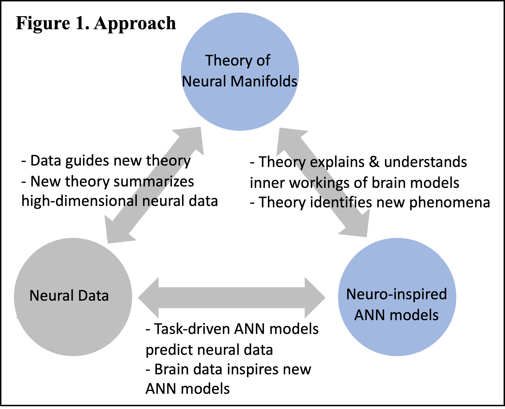
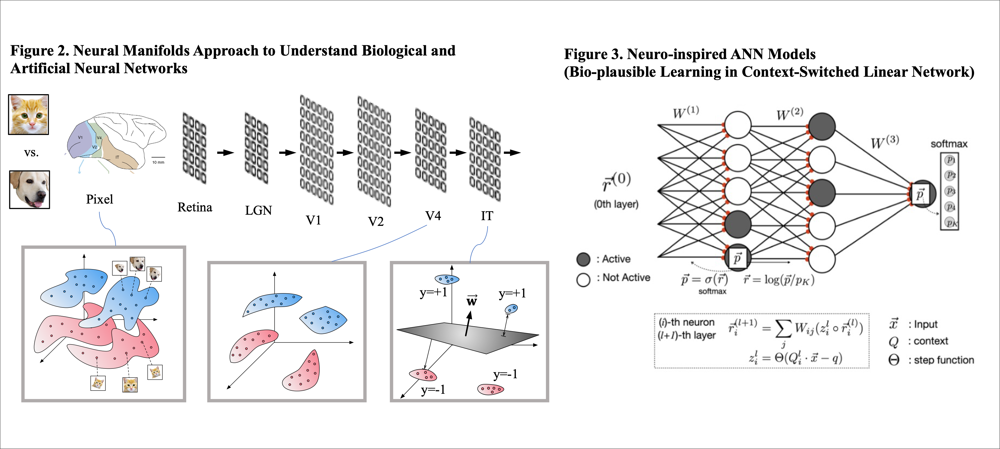

<h1> Research Statement </h1>
<h5> Dr. SueYeon Chung </h5>

 My research seeks to develop mathematical theories for understanding how structure gives rise to function in biological and artificial neural networks. 
Advances in experimental neuroscience techniques are transforming our understanding of the structure and function of neural circuits. Concurrent with this transformation has been the emergence of the field of Deep Learning driven by the remarkable performance of Artificial Neural Networks (ANNs). While the two fields have different tools and applications, they tackle a similar question: how do orchestrated computations arise from the collective structure of small neuronal units interacting with each other? 

 My research focuses on addressing this question through two broad approaches (Figure 1) at the intersection of deep learning and brain science: (1) developing mathematical theories for characterizing the structure of representations in artificial neural networks and the brain, and (2) building ANN models of the brain with neurally plausible architecture and learning rules. 

<table class="center">
    <tr>
    <td> </td>
    <td> </td>
    </tr>
</table>

<h3> From Structure to Function: Theory of Neural Manifolds in ANNs and Brain Representations </h3>

 The use of ANNs as models of the brain has gained popularity in the past few years[1] due to their remarkable similarity to brain data. Because of the relative ease of training and extracting data compared to biological networks, ANNs provide a plethora of new phenomenology for us to explain and understand. A key challenge in understanding how internal representations of ANNs encode information lies in their high dimensional nature. Specifically, which properties of neural population activity determine how good the representation is for a functional task? 

 To answer this question, together with Haim Sompolinsky at Harvard, I developed a theory of object manifolds[2–4], defined by population responses to an object.  We introduced the notion of ‘object manifold capacity’, generalizing the perceptron capacity of points to object categories. We showed that this object manifold capacity is determined by the geometric structure of the object manifold, formally establishing the connection between structure in the high dimensional neural representation and the representation’s capacity for categorization. Using measures from this theory, I then showed that hierarchical layers in visual ANNs encode increasing amounts of object information per neuron, due to the decreasing size and gradual correlation of these object manifolds as a function of layer depth [5] (Figure 2). This work allows for a more refined characterization of the ‘untangling’ hypothesis[6] in vision, where ‘untangling’ can be demonstrated not only with better linear decodability, but also with underlying neural structure. Next, I used these measures to characterize the visual cortex, where the correlation structure shows a different trend from ANNs[7]. I hypothesize that this is due to the fact that, unlike standard ANNs, the brain represents information for tasks beyond categorization. 

 Motivated by this demonstration of representation untangling in vision systems, my subsequent work with Josh McDermott (MIT) and Intel AI showed that speech-processing ANNs[8] employ similar strategies for changing neural manifolds structure: specifically, auditory objects become untangled in a similar manner to vision systems[9].  More recently, in collaboration with Yoon Kim (MIT-IBM Watson AI) and Intel AI, I have demonstrated that deep attention-based models trained for language processing tasks, known to capture human brain activity during language comprehension[10], also employ structural untangling of language object manifolds[11]. The fact that our neural object manifold theory can be applied to several modalities (vision, auditory, language) points to its versatility as a theoretical technique. 

<h3> The Emergence of Structure and Function: Biologically Plausible Learning in ANN Models of the Brain </h3> 

 Learning in nervous systems is crucial for animals to develop appropriate behaviors in response to stimuli. Underlying this behavioral learning is neuronal level plasticity. Task-optimized ANNs often show neural responses resembling those in the brain[1,12]. However, most of these highly performant ANNs learn through backpropagation, which is generally considered to be biologically implausible. Finding a biologically plausible learning rule that preserves or improves task performance in large-scale systems like ANNs could lead to a better theory of the brain. 

 My recent work at Columbia with Larry Abbott has focused on developing new biologically plausible local learning techniques and architectures utilizing recent experimental findings in electric fish[13] (Figure 3). In initial work, I have shown that learning rules that separate paths for learning and inference are able to learn locally and show superior performance in tasks that are known to be difficult for backpropagation, such as multi-task learning. One of the key findings of this new local learning model is that, unlike backpropagation models that tend to perform well only in the network’s final output layer, these models show good performance at intermediate stages of the network hierarchy, a feature also seen in neural systems. I plan to further develop these models in close collaboration with experimentalists to test them on neural data, and through large-scale numerical experiments to test the performance of these new learning algorithms. These extensions are of interest not only to our understanding of the relationship between neuronal synaptic learning and cognitive performance, but also as a general framework for building distributed learning systems that go beyond the current limits of training paradigms in ANNs. 

<h3> Future Work </h3> 
<h4> Computing with Neural Manifolds: General Theory of Task-Efficient Neural Geometry </h4>

 Central to the theory of neural manifolds is the assumption that there exists an efficient and robust neural representation of a given task. While the theory of object manifolds provides insights and characterization tools for an efficient geometry for a classification task, there are many other tasks in animal behavior and human cognition where a formal theory connecting underlying representation structure and task efficiency could be useful. 

 For example, recent reports suggest that efficient shared representations of multiple abstract variables may be in the form of disentangled or factorized geometry[14,15]. Studies in ANNs and the visual cortex suggest that for video prediction tasks, straightened trajectories may be desirable[16,17]. In the motor cortex, temporal trajectories during a cycling task reveal that lower tangling of trajectories confers noise robustness[18]. Neural trajectories in the hippocampus in spatial navigation and sequential prediction tasks suggest that adjacent behavioral or memory states may be encoded as neighboring fields on graph-like topological maps within neural state space[19,20]. This is broadly relevant for event representations in episodic memory, reinforcement learning, and future planning. 

 I plan to continue developing the formal theory of efficient neural geometry for tasks beyond categorization, such as shared representations, and continuous or sequential prediction tasks. I will also expand the applications of the theory to probe across multiple areas of the brain and representations evolving over time. 

 The brain is known for its amazing flexibility, as it is capable of switching between many tasks and is able to learn new tasks quickly. Does this multitask flexibility of the brain come from modularity or from the generality of representations across regions and tasks? Ultimately, expanding the battery of tasks covered by the formal theory of task-efficient neural geometry will help us probe the origin of task flexibility in neural representations. 

<h4> The Role of Biological Constraints in Task-Efficient Geometry </h4>

 Recently, several studies have reported that introducing features from neuroscience, such as neural noise, statistics of filters, or spectral properties, allows ANNs to perform robustly in the presence of adversarial attacks (small changes in stimuli that are imperceptible to humans but change decisions of standard ANNs)[21,22]. Understanding why these biological constraints result in adversarial robustness may hold the key to understanding how robust object recognition is done in the human brain. To answer this, together with the Jim DiCarlo and Josh McDermott labs at MIT, I have geometrically analyzed how adversarial perturbations propagate across the hierarchy of visual and auditory ANNs in the presence of neural noise. My initial results suggest that stochastic neural noise tames adversarially perturbed representations by embedding them into nearby state space, whereas without neural noise, adversarially perturbed representations end up exploding as they propagate in the layer hierarchy. The neural manifolds probe is especially useful here, because it allows us not only to characterize the structure of high-dimensional data clouds, but also trace back these properties to individual neuron statistics.

 I plan to continue using neural manifold probes to gain a better understanding of the effect of biological constraints on the structural and computational aspects of neural representations. This list of biological constraints includes the heterogeneity of cell types, neuronal activation profiles, synaptic connectivity structure, the sparsity of connectivity and activity, and neuromodulation. 

<h4> The Role of Biological Constraints in Learning </h4>

 My work on developing biologically plausible local learning models described above (Section 2) shows that several structures are required to achieve local learning. First, local learning is made possible due to distinct inference and learning signals, which in turn is driven by a non-linear neuronal activation function. In addition, context dependence allows for high expressivity of the network, and sparse gating allows for this crucial context dependence. Finally, local category inference is made via a local softmax function, enabled by lateral connections. I plan to continue identifying essential neural elements for biologically plausible learning rules similar to synaptic plasticity. 

 
<h4> Language Processing in ANNs and The Brain </h4>

 In my recent work on geometry in deep language models[11] discussed in Section 1, while separable “language manifolds” emerged for semantic categories such as words, the emergence of syntactic information was not captured by category-based object manifold theory. Meanwhile, studies show that there is a subspace within deep language model representations where syntactic structures are represented as geometric trees in representation space[23]. This leads to the next outstanding question, which I plan to explore as faculty: what is the geometry of language representations in the brain? 

<h4> The Geometry of Evidence Accumulation in the Presence of Uncertainty </h4>

 Recently, geometrical insights have proven crucial in understanding how prior integration is employed by the prefrontal cortex, where context-dependent priors warp the trajectories of the neural dynamics in a temporal time estimation task[24]. Given a non-uniform prior across object classes (i.e., different distributions of training examples), how would this prior warp the distribution of object manifold properties? Does the theoretical prediction from prior-warped object manifold properties capture the Bayes-optimal performance? I plan on developing the geometrical account of Bayesian computation, for categorization and discrimination. 

<h4> A Multiscale Theory of the Brain </h4>

 Robustness to variability is one of the most quintessential features of the brain. As neural manifolds are ubiquitous across modalities and tasks, exciting future work lies ahead. Outstanding questions include: is there representation untangling in the olfactory cortex, despite the fact that the early processing stage is known to be much more random compared to other sensory domains? Is there a similar untangling phenomenon in the somatosensory cortex? Which neuronal properties are the key constraints for the emergence of untangling? Are the key neuronal properties for untangling different for different tasks, and can it explain the different neuron types in different regions of the brain? 

 Neuronal geometry is a crucial intermediate descriptor between task efficiency and the collective structure of individual neurons, and it may hold a key for unifying the descriptions of structure and function at different scales, ranging from single neurons to populations to behavior. 

<h3> References </h3>
<ol>
<li> 
Yamins DLK, Hong H, Cadieu CF, Solomon EA, Seibert D, DiCarlo JJ. Performance-optimized hierarchical models predict neural responses in higher visual cortex. Proc Natl Acad Sci. 2014;111: 8619–8624.
</li>
<li>
Chung SY, Lee DD, Sompolinsky H. Linear readout of object manifolds. Physical Review E. 2016;93: 060301.
</li>
<li>
Chung SY, Lee DD, Sompolinsky H. Classification and Geometry of General Perceptual Manifolds. Physical Review X. 2018;8: 031003.
</li>
<li>
Chung SY, Cohen U, Sompolinsky H, Lee DD. Learning Data Manifolds with a Cutting Plane Method. Neural Computation. 2018;30: 2593–2615.
</li>
<li>
Cohen U*, Chung SY*, Lee DD, Sompolinsky H. Separability and geometry of object manifolds in deep neural networks. Nature Communications. 2020;11: 746.
</li>
<li>
DiCarlo JJ, Cox DD. Untangling invariant object recognition. Trends in Cognitive Sciences. 2007;11: 333–341.
</li>
<li>
Chung SY, Dapello J, Cohen U, DiCarlo J, Sompolinsky H. Separable Manifold Geometry in Macaque Ventral Stream and DCNNs. Computational and Systems Neuroscience. 2020.
</li>
<li>
Kell AJE, Yamins DLK, Shook EN, Norman-Haignere SV, McDermott JH. A Task-Optimized Neural Network Replicates Human Auditory Behavior, Predicts Brain Responses, and Reveals a Cortical Processing Hierarchy. Neuron. 2018;98: 630–644.e16.
</li>
<li>
Stephenson C, Feather J, Padhy S, Elibol O, Tang H, McDermott J, Chung SY. Untangling in Invariant Speech Recognition. Advances in Neural Information Processing Systems. 2019.
</li>
<li>
Schrimpf M, Blank I, Tuckute G, Kauf C, Hosseini EA, Kanwisher N, et al. Artificial Neural Networks Accurately Predict Language Processing in the Brain. bioRxiv. 2020. p. 2020.06.26.174482. doi:10.1101/2020.06.26.174482
</li>
<li>
Mamou J, Le H, Del Rio M, Stephenson C, Tang H, Kim Y, Chung SY. Emergence of Separable Manifolds in Deep Language Representations. International Conference on Machine Learning. 2020.
</li>
<li>
Khaligh-Razavi S-M, Kriegeskorte N. Deep supervised, but not unsupervised, models may explain IT cortical representation. PLoS Computational Biology. 2014;10: e1003915.
</li>
<li>
Muller SZ, Zadina AN, Abbott LF, Sawtell NB. Continual Learning in a Multi-Layer Network of an Electric Fish. Cell. 2019;179: 1382–1392.e10.
</li>
<li>
Bernardi S, Benna MK, Rigotti M, Munuera J, Fusi S, Salzman CD. The Geometry of Abstraction in the Hippocampus and Prefrontal Cortex. Cell. 2020;183: 954–967.e21.
</li>
<li>
Henselman-Petrusek G, Segert S, Keller B, Tepper M, Cohen J. Geometry of Shared Representations. Conference on Cognitive Computational Neuroscience. 2019.
</li>
<li>
Hénaff OJ, Goris RLT, Simoncelli EP. Perceptual straightening of natural videos. Nature Neuroscience. 2019;22: 984–991.
</li>
<li>
DiCarlo JJ, Zoccolan D, Rust NC. How does the brain solve visual object recognition? Neuron. 2012;73: 415–434.
</li>
<li>
Russo AA, Bittner SR, Perkins SM, Seely JS, London BM, Lara AH, et al. Motor Cortex Embeds Muscle-like Commands in an Untangled Population Response. Neuron. 2018;97: 953–966.e8.
</li>
<li>
Stachenfeld KL, Botvinick MM, Gershman SJ. The hippocampus as a predictive map. Nature Neuroscience. 2017;20: 1643–1653.
</li>
<li>
Low RJ, Lewallen S, Aronov D, Nevers R, Tank DW. Probing variability in a cognitive map using manifold inference from neural dynamics. bioRxiv. 2018. doi:10.1101/418939
</li>
<li>
Dapello J, Marques T, Schrimpf M, Geiger F, Cox DD, DiCarlo JJ. Simulating a Primary Visual Cortex at the Front of CNNs Improves Robustness to Image Perturbations. Advances in Neural Information Processing Systems. 2020.
</li>
<li>
Nassar J, Aleksander Sokol P, Chung SY, Harris KD, Memming Park I. On 1/n neural representation and robustness. Advances in Neural Information Processing Systems. 2020.
</li>
<li>
Hewitt J, Manning CD. Structural Probe for Finding Syntax in Word Representations. Conference of the Association for Computational Linguistics. 2019. pp. 4129–4138.
</li>
<li>
Sohn H, Narain D, Meirhaeghe N, Jazayeri M. Bayesian Computation through Cortical Latent Dynamics. Neuron. 2019;103: 934–947.e5.
</li>
</ol>
